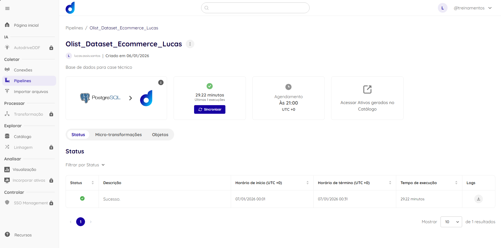
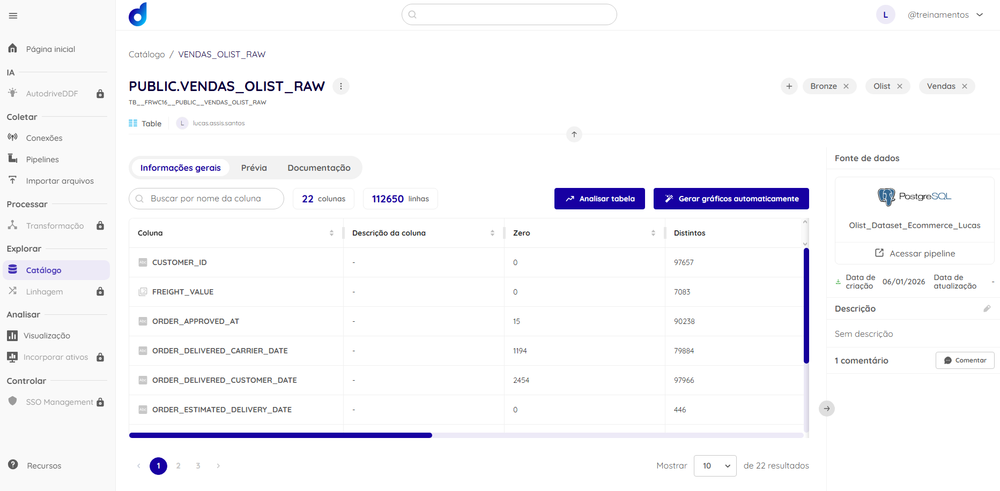
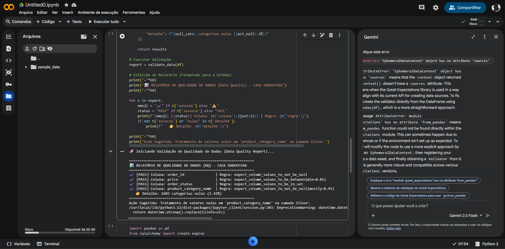
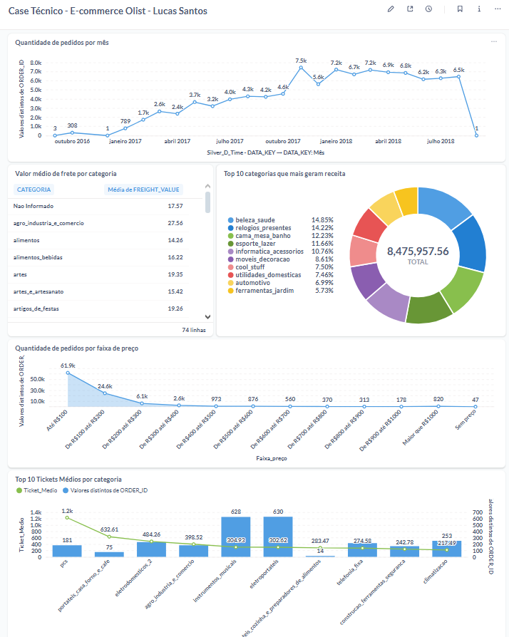

# Case Técnico - Dadosfera 

**Candidato:** Lucas de Assis Santos

**Repositório:** `LUCAS_SANTOS_DDF_TECH_012026`

**Data:** Janeiro 2026  

**Link Video apresentação:** https://www.youtube.com/watch?v=W55Qhuspw8s

---

## 📑 Resumo do Projeto
Este repositório contém a resolução do case técnico para a Dadosfera, abrangendo desde a ingestão de dados transacionais de e-commerce até a disponibilização de insights via IA e Dashboards.

---

## 1. Ingestão de Dados (Módulo Integrar)
Realizei a carga dos dados brutos do dataset Olist (Kaggle) utilizando um pipeline Python para um banco PostgreSQL hospedado na AWS RDS, que foi posteriormente integrado à Dadosfera.

* **Ativo na Dadosfera:** [Link para o Dataset Ingerido](https://app.dadosfera.ai/pt-BR/collect/pipelines/2928c979-83e7-4e09-92c2-29698a60be36)
* **Print da Ingestão:**

---

## 2. Catálogo e Governança (Módulo Explorar)
O dataset foi catalogado com metadados detalhados, tags de governança para garantir a rastreabilidade.

* **Ativo na Dadosfera:** [Link para o Catálogo](https://app.dadosfera.ai/pt-BR/catalog/data-assets/c3e06ec3-95fe-4a83-a9a0-1e646a839658)
* **Evidência de Documentação:**

---

## 3. Data Quality (DQ)
Implementação de suíte de testes para validação de integridade (verificação de nulos, tipos de dados e regras de negócio como preços positivos).

* **Script de Validação (CSV):** [Link para o Script/Notebook](https://colab.research.google.com/drive/1l6taHjDkL9nZ6dj4U0KJubERSLl55boG#scrollTo=TZcBmwFfCOhI&line=10&uniqifier=1)

* **Script de Validação (PostgreSQL):** [Link para o Script/Notebook](https://colab.research.google.com/drive/1l6taHjDkL9nZ6dj4U0KJubERSLl55boG#scrollTo=KE7KcaRKF9SN&line=6&uniqifier=1)

* **Relatório de Qualidade:**

---

## 4. Modelagem Dimensional (Metabase)
Os dados foram estruturados no Metabase seguindo **Medallion architecture** e também o modelo **Star Schema**, com a criação de tabelas de Fato e Dimensões (Camadas Silver e Gold).

* **Estrutura:**
    * `Silver_F_Orders`: Tabela Fato de Vendas.
    * `Silver_D_Time`: Dimensão Calendário.
* **Queries SQL:** [Pasta de Scripts SQL](./sql)

---

## 5. Análise e Visualização (Metabase)
Organização de pastas (Bronze, Silver, Gold) no Metabase e criação de um Dashboard estratégico com 5 indicadores chave.

* **Dashboard no Metabase:** [Link para o Dashboard](http://metabase-treinamentos.dadosfera.ai/public/dashboard/238ed429-245f-4097-9b10-c271b93fce0f)

* **Pasta Gold (Queries):** [Link para Pasta Gold](https://metabase-treinamentos.dadosfera.ai/collection/961-gold)

* **Print do Dashboard:**

---
## 🚀 Planos Futuros e Escalabilidade

Este projeto foi desenhado para ser a base de uma plataforma de dados robusta. Como próximos passos para evolução da maturidade analítica, prevemos:

1. **Integração Nativa com LLMs:** Embora o processamento de texto (sentimento/categoria) tenha sido simulado via Python/Prompt Engineering, a arquitetura está 100% pronta para ser integrada aos serviços de LLM da **Dadosfera**, permitindo análise em tempo real de milhares de reviews.
2. **Automação de Data Quality:** Implementar o monitoramento de qualidade diretamente no pipeline da Dadosfera, criando alertas automáticos via e-mail ou Slack caso inconsistências sejam detectadas no Snowflake.
3. **Previsão de Churn (ML):** Utilizar os dados estruturados na Camada Gold para treinar modelos de Machine Learning que identifiquem clientes com alta probabilidade de abandono com base no sentimento dos reviews.
---
